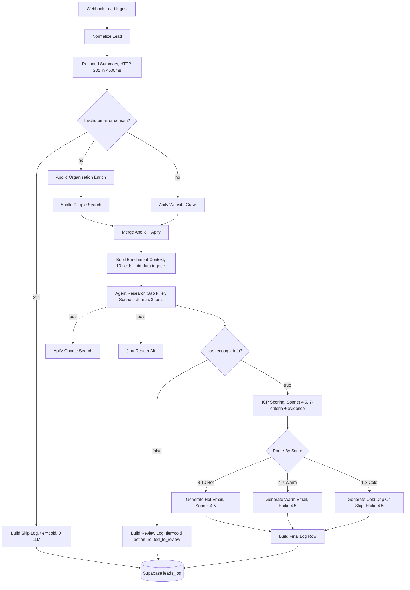

# Task A | Multi-Step Outreach Sequencing Agent

Submission for the Instantly take-home Task A. The workflow ingests a lead (`{email, company_domain}`) via webhook, enriches it with Apollo and Apify, runs an agentic research step when the enrichment is thin, scores against a 7-criteria ICP, routes the lead to a Hot / Warm / Cold sequence, drafts a personalized first email (or skips with a documented reason), and logs the full decision chain.

Deliverables in this repo:
- `task-a-workflow.json` | n8n workflow export
- `leadresult.html` | 12-lead visual walkthrough, open in any browser
- `prompts/` | all prompts used + notes on what I would iterate next
- `schema.sql` | Supabase table for the audit log

**View the 12 sample runs directly in your browser** (rendered from this repo via GitHub Pages):

**https://maxime-ktcm2.github.io/instantly-task-a/leadresult.html**

Same data is also mirrored to a Google Sheet for spreadsheet review:
https://docs.google.com/spreadsheets/d/11DkeKXnXz0PNSYL4rBDiYVqe0SNG2Cs9oIHa8BSLkFg/edit?usp=sharing

## TL;DR

- Webhook receives `{email, company_domain}`, ACKs early with HTTP **202** (Accepted) in the live n8n node, then runs the full pipeline asynchronously.
- Enrichment: **Apollo Org + Apollo People Search + Apify Website Crawler + Jina Reader + Apify Google Search** (5 sources, agent picks tools when data is sparse).
- Scoring: DeCE-style 7-criteria decomposed rubric with verbatim evidence quotes, holistic 1-10 final, deterministic tier routing, and a disqualifier whitelist that blocks ad-hoc labels like `product_market_mismatch`.
- Email: tier-specific prompt with banned-cliches blocklist, evidence-anchored body, Maxime signature enforced.
- Logging: one Postgres row per lead in Supabase `leads_log` recording raw Apollo response, agent tool trace, 7 criteria scores with verbatim evidence quotes, generated email or skip reason, action taken, and retry metadata.

**Full per-lead walkthrough (canonical view)**: https://maxime-ktcm2.github.io/instantly-task-a/leadresult.html | 12 tabs, one per lead, showing the Apollo data, agent search calls, scoring with evidence, and the drafted email or skip reason.

### Sample results | 12 leads, distribution 3 Hot / 3 Warm / 6 Cold (5 disqualifier skips + 1 fast-path)

| # | Company | Tier | Score | Action |
|---|---|---|---|---|
| S01 | Stripe (role account) | cold | 2 | skipped_disqualifier (role_account + enterprise_off_icp) |
| S02 | Lemlist | cold | 1 | skipped_disqualifier (competitor) |
| S03 | Dead domain | cold | 1 | skipped_disqualifier (website_unresolved) |
| S04 | Invalid email | cold | 1 | skipped_invalid_email (fast-path) |
| S05 | Merge.dev | warm | 5 | email_drafted |
| S06 | Belkins | cold | 2 | skipped_disqualifier (outbound_agency_service_provider) |
| S07 | Paddle | warm | 4 | email_drafted |
| S08 | Sqell | cold | 1 | skipped_disqualifier (competitor) |
| S09 | Pylon | hot | 9 | email_drafted ("Scaling Pylon's first VP Sales + 15 AEs on outbound") |
| S10 | Linear | hot | 9 | email_drafted ("Scaling Linear's new AE hires with cold email") |
| S11 | Retool | warm | 7 | email_drafted |
| S12 | Vapi | hot | 9 | email_drafted ("Series B + scaling voice agents at 750K developers") |

## PDF Task A requirements | where each is addressed

| PDF requirement | Status | Section |
|---|---|---|
| 1. Receive webhook payload `{email, company_domain}` | done | [Webhook + ACK pattern](#webhook--ack-pattern) |
| 2. Enrich the lead (scrape + >=1 API) | done | [Enrichment stack](#enrichment-stack) |
| 3. Gather company description, size, industry, tech stack | done | [Enrichment stack](#enrichment-stack) |
| 4. Score against ICP criteria you define | done | [Scoring methodology](#scoring-methodology) |
| 5. Output structured 1-10 with reasoning | done | [Scoring methodology](#scoring-methodology) |
| 6. Route Hot / Warm / Cold sequence | done | [Email generation](#email-generation) |
| 7. Generate personalized first email | done | [Email generation](#email-generation) |
| 8. Log full decision chain | done | [Logging in Supabase](#logging-in-supabase) |
| 9. Agentic Twist (decision logic for extra research) | done | [Agentic decision logic](#agentic-decision-logic) |
| Deliverable: README + prompts + workflow JSON | done | this file + `prompts/` + `task-a-workflow.json` |

## Architecture



Key design decisions:
- **Async ACK (HTTP 202)** because pipeline takes 40-130s, well over Stripe (20s), GitHub (10s), AWS API Gateway (29s), nginx default (60s) webhook timeouts. Caller polls Supabase `leads_log` by `event_hash`.
- **Single LLM provider (Anthropic)** keeps auth surface minimal. Sonnet 4.5 for judgment (agent + scoring + Hot email), Haiku 4.5 for Warm + Cold drafting (~4x cheaper).
- **Deterministic routing** on `final_score` (Switch node), not LLM choice. One source of truth, auditable.
- **Disqualifier whitelist** in scoring prompt rejects ad-hoc labels (`product_market_mismatch`, `wrong_business_model`). Non-outbound SaaS like Pylon and Linear are scored normally on the 7 criteria.

## Webhook + ACK pattern

Webhook `POST /webhook/lead-ingest-v2` accepts JSON `{"email": "...", "company_domain": "..."}` and returns HTTP **202 Accepted** with `{status, event_hash, role_account, reason?, message}`. Body is sent immediately; `respondToWebhook` does not halt downstream execution. The full enrichment + scoring runs asynchronously. The caller polls Supabase `leads_log` by `event_hash` for the final decision. Industry references: [Stripe webhook docs](https://docs.stripe.com/webhooks), [Svix Webhook Timeout Best Practices](https://www.svix.com/resources/webhook-university/reliability/webhook-timeout-best-practices/).

## Enrichment stack

Five sources, agent autonomously picks between them when Apollo + Apify are insufficient.

| Source | Endpoint / Actor | What it provides | Why |
|---|---|---|---|
| **Apollo Organization Enrich** | `GET /api/v1/organizations/enrich` | firmographics, industries[], keywords[], employees, country, founded, funding, technologies[] | Largest B2B company DB (~75M companies). Free tier covers org endpoint. |
| **Apollo People Search** | `POST /api/v1/mixed_people/api_search` | senior people at the company (founder, c_suite, vp, head, director) | Mitigated by agent web verification when this endpoint returns no people for a domain. |
| **Apify Website Content Crawler** | `apify/website-content-crawler` | full-page markdown across home + `**/about*`, `**/careers*`, `**/services*`, `**/products*` | Cheerio fast for static, Playwright fallback for JS. Multi-page beats single-page Jina. |
| **Apify Google Search** (agent tool) | `apify/google-search-scraper` | organic results title + URL + snippet | Used by agent for LinkedIn snippets, funding articles, careers pages. Replaced a Serper HTTP tool that broke in this n8n runtime. |
| **Jina Reader Alt** (agent tool) | native `jinaAiTool` reader mode | clean markdown from any concrete URL | Fast, free, bypasses JS. Does not read LinkedIn reliably (documented in prompt). |

`Build Enrichment Context` normalizes everything into a single `combined_enrichment` object with 19 fields (firmographics, person, website excerpt, `thin_data_triggers[]`) wrapped in `<enrichment>` for the LLMs.

**Reliability choice**: `Build Enrichment Context` reads Apollo Org, Apollo People, and Apify summaries directly from their upstream nodes. This avoids losing firmographics when a secondary enrichment branch returns an error object.

## Scoring methodology

**Why these 7 criteria**. I treated Instantly as the seller and scored for likely buyers of cold-email automation: B2B companies doing, or about to do, sales-led outbound. The 7 axes cover who they are (industry, size, geography), who the contact is (seniority), and whether there is a current moment of need (sales hiring, funding/growth, outbound stack). Full rubric in `prompts/icp-criteria.md`.

**The 7 criteria** (each scored 0/1/2, evidence-anchored):

| Criterion | 0 | 1 | 2 |
|---|---|---|---|
| **industry_fit** | retail, hospitality, B2C, K-12 | ecom, consumer fintech | B2B SaaS, agency, MarTech, SalesTech, RevOps |
| **size_fit** | <10 or >2000 | 500-2000 or unknown | 10-500 |
| **seniority_fit** | Analyst, Coordinator | Manager, Sr. IC | Director, VP, Head, C-level, Founder |
| **geography_fit** | restricted markets | LatAm, SEA, EE, India, Africa | US, UK, CA, AU, Western EU |
| **intent_hiring_sales** | no signal | mentions sales team | active SDR/AE/BDR posting OR scaling sales |
| **intent_growth_funding** | no signal | older funding >18mo | recent funding <12mo OR fresh Series A/B/C |
| **intent_outbound_stack** | no signal | generic CRM only | Apollo, Outreach, Salesloft, Lemlist, Smartlead |

**Why DeCE-style decomposed scoring**. Asking an LLM "score this lead 1-10" directly is noisy. I use small evidence-backed judgments first, then a final holistic score. This makes the result easier to audit and closer to how a human ICP reviewer would reason.

**Evidence anchoring**. Each sub-score requires an `evidence_quote`: a verbatim snippet from the enrichment payload OR a sourced finding from the agent. If no evidence, score 0 with quote "no evidence". Prevents the LLM from inventing facts; without it we saw fabrication.

**Why holistic final, not weighted sum**. Weighted sums miss non-linear interactions (a lead with perfect signals but no decision-maker should not be Hot). The LLM emits a holistic 1-10 anchored by a subtotal-to-final reference table (subtotal 12-13 -> 9, etc.) to prevent drift.

**Backend caps**:
- `role_account=true` -> tier=cold, final<=2 (deliverability).
- `enrichment_inconsistent=true` (email_domain != company_domain, not a personal provider) -> cap final at 3.
- `website_unresolved=true` AND no agent evidence -> ceiling tier=warm.
- `email_matched_in_top_people=false` AND no agent-confirmed senior role -> cap seniority_fit at 1. Agent-confirmed senior role with sourced URL unlocks 2 with confidence <=0.8.
- Direct competitor detected -> `competitor_not_prospect`, force final=1-2, tier=cold (`industry_fit=2` preserved for audit clarity).

**Structured output**. The scoring node uses n8n `outputParserStructured` and returns `criteria_scores[]`, `disqualifiers_triggered[]`, `subtotal`, `final_score`, `tier`, `summary_reasoning`, and `confidence`.

## Email generation

Three separate prompts (Hot / Warm / Cold), one per tier. The PDF describes three distinct sequence styles with different word counts, tones, CTA pressure, and skip conditions. Separating produces tighter prompts and per-tier iteration.

| Tier | Prompt file | Model | Strategy | Word count |
|---|---|---|---|---|
| Hot (8-10) | `prompts/email-hot.md` | Sonnet 4.5 | High-touch, evidence-anchored, defensible meeting ask | 80-130 |
| Warm (4-7) | `prompts/email-warm.md` | Haiku 4.5 | Lower-pressure nurture, value-first, soft CTA | 70-110 |
| Cold (1-3) | `prompts/email-cold.md` | Haiku 4.5 | Drip OR skip, default to skip, 5 explicit triggers | 40-70 (drip), null (skip) |

**Why a banned-phrases blocklist, not "be specific"**. Initial drafts produced "Hope this email finds you well" every time despite "be specific" instructions. Anti-pattern lists work; positive-only instructions do not. Blocklist lives in `<banned_phrases>` of each prompt.

**Why default-to-skip on Cold**. Sending outbound to bad-fit leads hurts deliverability. Cold returns `action="skip"` with `skip_reason` for 5 explicit triggers (role_account, B2C, website_unresolved+no_external_evidence, enrichment_inconsistent, final<=2).

**Prompt design**. The prompts use XML-style sections (`<role>`, `<task>`, `<rules>`, `<output_format>`) so instructions, examples, and dynamic lead data stay separated. The scoring prompt also includes calibration examples, effectively an LLM-as-judge rubric for hot/warm/cold boundaries.

**Hard prompt constraints**:
- **em-dash ban** (Unicode U+2014): `If any em-dash appears in subject or body, response is INVALID. Use commas, colons, periods, or pipes only.`
- **Maxime signature MUST** (Hot + Warm): body must end with `Maxime` alone on the last line.

## Agentic decision logic

The PDF's "Agentic Twist": *the agent should decide it needs more information before scoring. If the website is thin or the enrichment API returns sparse data, autonomously take an additional research step.*

**Implementation**. LangChain Agent node (`@n8n/n8n-nodes-langchain.agent`, typeVersion 3.1) running Claude Sonnet 4.5 with structured output. The agent sees `combined_enrichment` plus `thin_data_triggers[]` (6 flags computed upstream: `missing_or_short_description`, `missing_company_size`, `missing_industry`, `missing_confirmed_decision_maker`, `thin_website`, `website_unresolved`).

**Decision rules** (in system prompt):
- Website < 500 chars -> call `jina_reader_alt` on the domain first.
- Apollo industry missing AND website unclear -> `web_search` for industry context.
- No decision-maker AND email local-part looks like a name -> `web_search "site:linkedin.com/in/{local_part} {company}"`.
- No funding signal -> `web_search "{company} funding"`.
- Outbound stack unknown -> `web_search "{company} Apollo Outreach Salesloft Lemlist Smartlead"`.
- `intent_hiring_sales` null with budget remaining -> `web_search "{company} careers SDR AE BDR"`.
- Apollo already returned industry + size + role + >=1 intent -> return `has_enough_info=true` with zero tool calls.
- Decisive negative signal (competitor, B2C-only, closed domain) -> return immediately.

**Hard caps**: `maxIterations=3`. Never invent. Don't infer employee count from pricing or domain extension. If Jina returns 400, do NOT retry; record the failure and fall back to web_search.

**Proof | Sample 12 Vapi**: Apollo returned `apollo_people_unavailable=true`. Agent fired 2 searches: (1) `jordan vapi.ai CEO founder LinkedIn` -> confirmed Jordan Dearsley Founder/CEO; (2) `vapi.ai funding series B careers VP sales` -> Series B closed, $70.1M total, VP Sales on team, 750K developers. Returns `has_enough_info=true` after 2 iterations. Scoring unlocks seniority=2, funding=2, hiring=2. Final 9.

**Proof | Sample 3 Dead Domain**: Apify 0 pages (DNS unresolvable). Agent: (1) `jina_reader_alt(https://deaddomain1234xyz.com)` -> HTTP 400 (recorded gracefully because `onError: continueRegularOutput`); (2) `web_search "deaddomain1234xyz.com"` -> zero results. Decisive negative, all 7 criteria=0, final=1, tier=cold, action=skip.

## Failure modes handled

| Failure mode | Handling | Verified by |
|---|---|---|
| Invalid email/domain format | Fast-path skip, 0 LLM calls, tier=cold | Sample 4 (`not.an.email`, 11ms total) |
| Role account `info@`, `sales@` | Full enrichment, backend flag forces tier=cold, Cold node skips | Sample 1 Stripe `info@stripe.com` |
| Apollo Organization Enrich empty | Continue with Apify + agent web search | Sample 3 dead domain, Sample 8 Sqell |
| Apollo People endpoint returns no people for a domain | `apollo_people_unavailable=true` flag set. Agent web-search verifies senior role via LinkedIn / company About / press. | Vapi, Linear, Pylon all confirmed CEO/founder via 1-2 searches. |
| Apify crawl thin (<200 chars) | `website_unresolved=true`. Agent fires `jina_reader_alt` on domain. | Sample 8 Sqell (36 chars -> Jina recovered full content) |
| Jina Reader 400 (domain not resolvable) | `onError: continueRegularOutput` on Jina node. Agent falls back to `web_search`. | Sample 3 dead domain |
| Agent runaway > 3 iterations | Hard cap `maxIterations=3` | All runs respected the cap |
| Agent unresolved (`has_enough_info=false`) | `Build Review Log` -> tier=cold, action=routed_to_review | Path exercised on earlier batches |
| Ad-hoc disqualifier label (`product_market_mismatch`, `wrong_business_model`) | Whitelist rejects non-canonical labels; non-outbound SaaS scored normally | Pylon and Linear both reach Hot 9 |
| Direct outbound competitor | Whitelist restricts `competitor_not_prospect` to Lemlist, Apollo, Outreach, Salesloft, Smartlead, Reply.io, La Growth Machine, Sqell. Keeps `industry_fit=2`, forces final=1-2. | Lemlist (`1108`), Sqell (`1095`) |
| Outbound agency / service provider | `outbound_agency_service_provider` disqualifier (Belkins, Cleverly, Martal) | Belkins (`1116`) score 2 |
| LLM provider transient failure | `retryOnFail=true, maxTries=3, waitBetweenTries=15000` on all 4 LLM nodes | Reduces transient failures; structural fix is a worker queue |
| Supabase `CHECK` mismatch | `action_taken` constraint expanded to 7 values, baked into `schema.sql` | Sample 4 invalid-email row inserted successfully |
| Email LLM injects em-dashes | Hard prompt constraint, invalid output if present | Checked in sample emails |
| Email LLM omits Maxime signature | Hard prompt constraint | Checked in sample emails |

## Judgment policy

Scoring prompt restricts disqualifiers to an explicit whitelist. Ad-hoc labels like `product_market_mismatch` are invalid.

| Lead pattern | Decision |
|---|---|
| Direct outbound software competitor | `competitor_not_prospect` -> tier=cold, final=1-2 |
| Outbound agency / service provider (Belkins-type) | `outbound_agency_service_provider` -> tier=cold, final=2-3 |
| Non-outbound B2B SaaS (dev tools, customer support, project mgmt) | Score normally on 7 criteria, no auto-disqualifier; weak outbound stack drives Warm |
| Role account (info@, sales@) | `role_account` -> enrich + log, skip auto-email, may combine with `enterprise_off_icp` if size > 2000 |
| Invalid email or domain | Fast-path skip + audit log, 0 LLM calls |
| Dead / unresolvable domain | `website_unresolved` + `dead_domain_no_web_presence` after agent verification -> cold/skip |

## Logging in Supabase + Google Sheet mirror

The PDF allowed "Google Sheet, Airtable, or simple DB". I chose both, for different reasons:

- **Supabase Postgres** = source of truth. A structured table is faster to query day-to-day than scattered execution logs, and as a developer I work faster against SQL. One row per lead. 3 months from now, "why did we mark Pylon as warm instead of hot?" is a single SQL query.
- **Google Sheets mirror** = human review surface. An 11-column compact view writeable to a Sheet so non-technical reviewers (PM, sales ops, account exec) can read decisions without SQL.

`leads_log` stores raw enrichment, agent tool trace, 7-criterion scoring with evidence quotes, disqualifiers, final tier, generated email or skip reason, and operational metadata such as LLM call count and event hash.

The exported workflow logs to Supabase only, to keep the import clean and avoid requiring a Google credential. For reviewer convenience, the 12 sample rows are mirrored in a separate Google Sheet.

**For the 12 sample runs**, the results are available in this Google Sheet:

**https://docs.google.com/spreadsheets/d/11DkeKXnXz0PNSYL4rBDiYVqe0SNG2Cs9oIHa8BSLkFg/edit?usp=sharing**

For a richer visual walkthrough with the full Apollo + agent trace + scoring evidence per lead, open `leadresult.html` in a browser.

## Known limitations

- **Apollo People coverage is partial in practice**: `/mixed_people/api_search` returns no people for most domains we tested, so `email_matched_in_top_people` is rarely true. The agent compensates by web-searching the email's local-part against LinkedIn and press.
- **LinkedIn data via search snippets, not a scraper**: Jina does not parse LinkedIn reliably and we did not wire an Apify LinkedIn scraper. Decision-maker confirmation relies on Google snippet titles, good for role identification but not for richer profile signals.
- **Google Sheets is reviewer-facing, not required to run the workflow**. Supabase is the workflow source of truth. The populated Google Sheet linked above mirrors the 12 sample runs for quick review without SQL.
- **LLM provider request pacing is reactive, not structural**: each LLM node has `retryOnFail` with backoff, but a real production deployment should put a worker queue (pgmq, BullMQ, n8n native queue) between the webhook and the LLM nodes so burst workloads are paced before they hit the provider.
- **No real cost tracking yet**: `total_cost_usd` is null on every row. Column wired but population not implemented. Wire Langfuse to fix.
- **Sample fixtures are real production runs against live APIs**, not unit-test fixtures. Re-running on the same email produces a new row with a fresh `event_hash` by design.

## What I'd improve with more time

| # | Improvement | Why |
|---|---|---|
| 1 | **SHA-256 idempotency dedup table active in pipeline** | `processed_events` exists in `schema.sql` but no upstream check yet. Critical at 100+ leads/day to avoid running the enrichment + scoring chain twice on the same lead. |
| 2 | **Per-lead cost tracking via Langfuse** | ~30 min setup, returns token usage + cost natively. Replaces the null `total_cost_usd` column with real numbers. |
| 3 | **Apollo plan upgrade OR Hunter.io fallback** | Free plan blocks `mixed_people/api_search`, caps seniority_fit at 1 unless agent unlocks via web. $49/mo upgrade fixes systemically. |
| 4 | **Evidence-fabrication post-LLM validator** | Substring-validate each `evidence_quote` against serialized enrichment text. Flag when >2 of 7 fail. Catches what anomaly detection misses. |
| 5 | **Anomaly detector gates the email-send path** | Currently logs `score_anomaly` flag when `|final - expected| > 2`; production should route to human review when triggered. |
| 6 | **Promptfoo eval harness + prompt caching** | Use a labeled golden set and an LLM-as-judge review pass for prompt changes, then add Anthropic prompt caching to reduce repeated static prompt cost. |

Prompt files include the exact system/user prompts plus concise notes on how I would evaluate and improve them next.

## Files in this deliverable

```
instantly-task-a/
  README.md                this file
  leadresult.html          primary visual artifact, 12-tab interactive showcase (open in any browser)
  task-a-workflow.json     n8n workflow export (HTTP 202 ACK, disqualifier whitelist)
  schema.sql               Supabase table leads_log with the action_taken enum, idempotent
  prompts/                 icp-criteria, icp-scoring, agent-research, email-hot/warm/cold, iteration-notes
```

Workflow validation via n8n MCP: **0 errors, 0 invalid connections**. Cleanly importable into a fresh n8n Cloud instance after wiring the 5 credentials (Anthropic, Apollo, Apify, Jina, Supabase).
